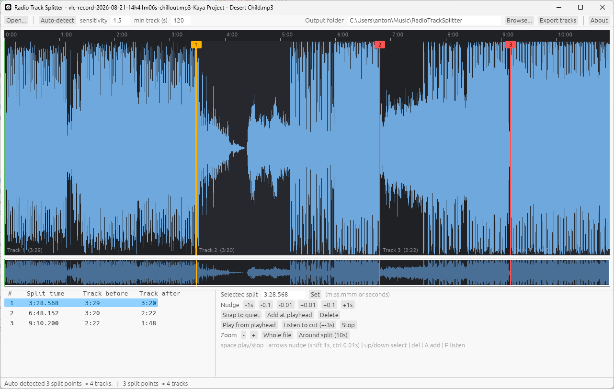

# Radio Track Splitter



Splits a long stream recording (e.g. an mp3) into separate track files. A
VGGish neural network finds where one track changes to the next, each cut is
snapped to the nearest quiet moment, and the tracks are written losslessly with
FFmpeg in the recording's own format: an mp3 gives mp3 tracks, an m4a gives m4a
tracks, and so on. The audio is copied as it is, never resampled or re-encoded
(the one exception is FLAC, which is re-encoded losslessly so the tracks get a
correct length; the decoded audio is identical).

Two programs are built from this repository:

| Program | Executable | What it does |
|---|---|---|
| Editor (GUI) | `radio-track-splitter.exe` | Waveform editor: auto-detects split points, lets you fix them by hand, listen to each cut, then export |
| Command line | `radio-track-splitter-cli.exe` | Detects the split points and exports the tracks in one go |


## Installing

Run `RadioTrackSplitter-Setup-<version>.exe`.

It installs per user, without admin rights, into
`%LOCALAPPDATA%\Programs\Radio Track Splitter` and downloads two dependencies:

- **FFmpeg** (`ffmpeg`, `ffprobe`, `ffplay`; about 110 MB)
- **VGGish weights** `vggish-10086976.pth` (about 275 MB)

Both downloads are checked against a pinned SHA-256. A download is skipped if the
file is already on the PC (FFmpeg on `PATH`, weights in the torch cache).
Silent install: `RadioTrackSplitter-Setup-<version>.exe /S`.

## Usage

```powershell
radio-track-splitter.exe [recording.mp3]                            # editor
radio-track-splitter-cli.exe recording.mp3 --dry-run                # just print split points
radio-track-splitter-cli.exe recording.mp3 -o D:\tracks             # choose another output folder
```

Tracks are written to `%USERPROFILE%\Music\RadioTrackSplitter` by default (the editor's
output folder box, and the CLI's `-o`, change that). They are named after the
recording and keep its file type: `<recording name>_track_001.mp3` for an mp3,
`..._001.m4a` for an m4a. The CLI's `--prefix` replaces the
`<recording name>_track_` part. Run
`radio-track-splitter-cli.exe --help` for all options (`--sensitivity`,
`--min-track-length`, `--snap-window`, `--weights`, ...).

The slow neural-network step is cached per recording, in
`%TEMP%\radio-track-splitter\vggish_cache_<hash>.bin`. Reopening the same, unmodified
file skips it. These files only hold recomputable data, so deleting them (or Windows
clearing the temp folder) is always safe; it just costs a recompute.

The app looks for FFmpeg on `PATH` and in its own folder, and for the weights
next to the executable, then in the torch hub cache, then in
`%LOCALAPPDATA%\radio-track-splitter`. If none is found it downloads the weights
there on first use (needs `curl`, included with Windows 10 and later).

## Building from source

Requires:

- the [Rust toolchain](https://rustup.rs) (MSVC target on Windows)
- `make`:

  ```powershell
  winget install ezwinports.make
  ```

```powershell
make build
```

Executables are written to `target\release\`. The C runtime is linked
statically (see `.cargo/config.toml`), so no Visual C++ Redistributable is needed.

The `Makefile` wraps the other common commands too:

| Command | What it does |
|---|---|
| `make build` | `cargo build --release` |
| `make test` | `cargo test` (unit tests) |
| `make clippy` | `cargo clippy --all-targets` |
| `make fmt` | `cargo fmt` |
| `make run FILE=recording.mp3` | run the editor, optionally opening `FILE` (`FILE` may be omitted) |
| `make cli FILE=recording.mp3 CLI_ARGS="-o D:\tracks"` | run the CLI, with any extra args in `CLI_ARGS` |
| `make dry-run FILE=recording.mp3` | run the CLI with `--dry-run` |
| `make installer` | build the installer into `dist\` (add `SKIP_CARGO=1` to skip the `cargo build`) |
| `make installer-test` | build the `-test` installer variant that forces downloads (also takes `SKIP_CARGO=1`) |
| `make clean` | `cargo clean` and remove `dist\` |
| `make help` | list all of the above |

## Building the installer

The installer is an [NSIS](https://nsis.sourceforge.io) script in `installer/`.

**Prerequisites**

- Windows 10 or later (the installer uses the built-in `curl`, `tar` and `certutil`)
- Rust toolchain and `make` (as above)
- NSIS 3:

  ```powershell
  winget install NSIS.NSIS
  ```

**Build**

```powershell
make installer
```

The script:

1. finds `makensis` (on `PATH`, or in `Program Files (x86)\NSIS`);
2. downloads the [NScurl](https://github.com/negrutiu/nsis-nscurl) NSIS plugin on
   first run (pinned by SHA-256, cached in `installer\plugins\`), which gives the
   installer HTTPS downloads with a progress bar;
3. runs `cargo build --release --bins`;
4. compiles `installer\radio_track_splitter.nsi` with the version from `Cargo.toml`.

Result: `dist\RadioTrackSplitter-Setup-<version>.exe` (about 7 MB; FFmpeg and the
weights are downloaded when the installer runs, not embedded).

Use `make installer SKIP_CARGO=1` to package the binaries already in
`target\release\` without rebuilding them.

To release a new version, bump `version` in `Cargo.toml` and run the script. That is
the only place the version is defined: the script reads it from cargo and hands it to
NSIS, and the app (About dialog, `--version`) reads it at compile time. A
pre-release such as `0.2.0-beta.1` works too.
